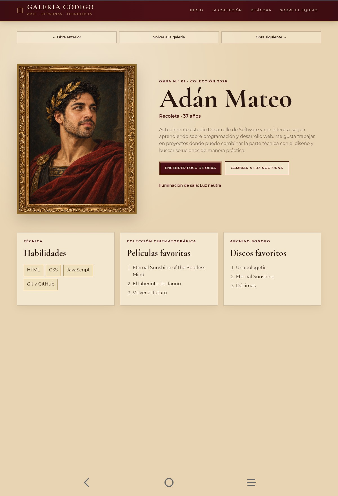
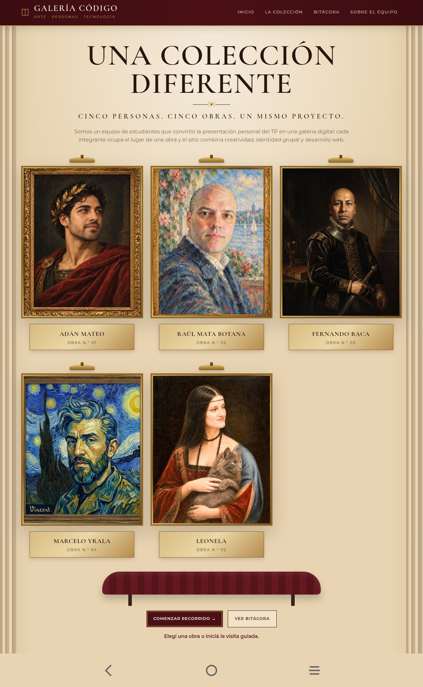
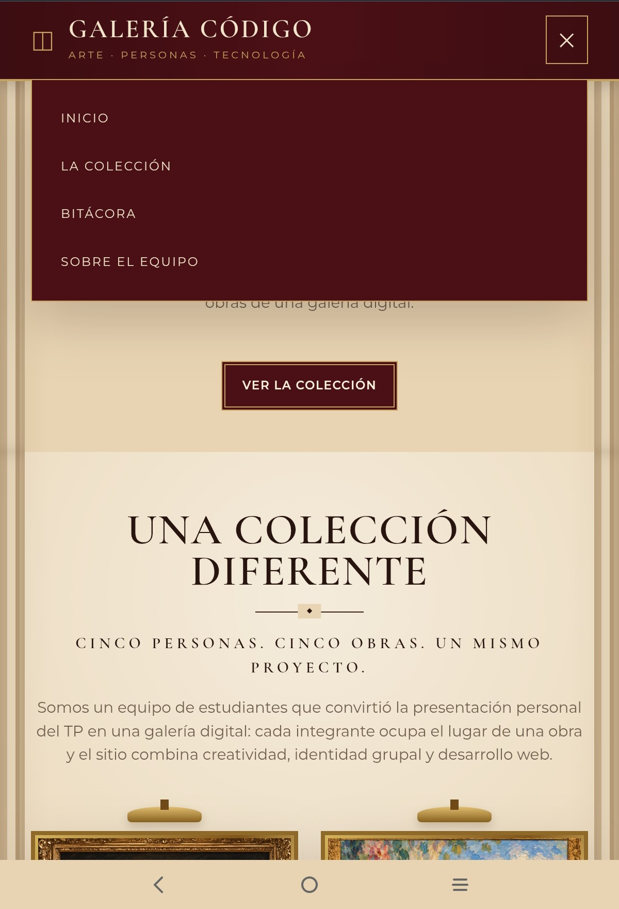
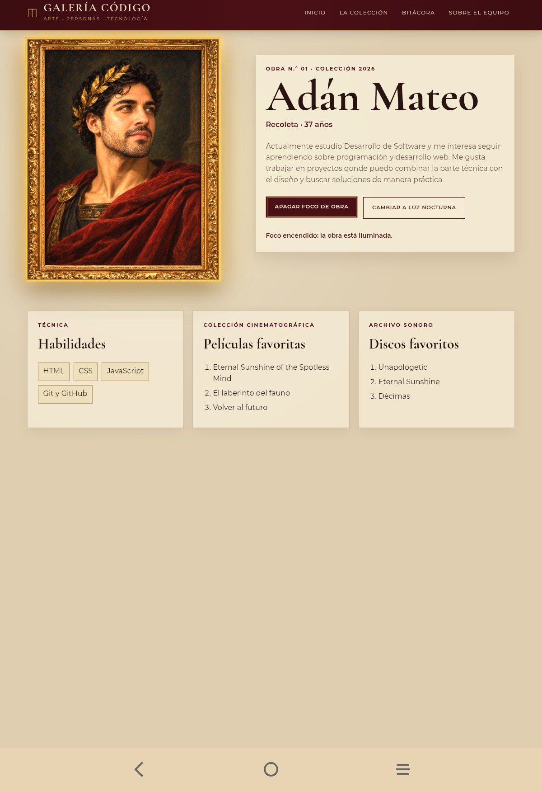

# Galería Código

**Trabajo Práctico Grupal 1 · Proyecto web en equipo · HTML, CSS y JavaScript**

## Descripción

**Galería Código** es un sitio web grupal con estética de museo. La idea fue presentar a cada integrante como una obra dentro de una misma colección, manteniendo una identidad visual común pero permitiendo que cada retrato tenga su propio estilo.

La página principal presenta la colección completa y permite acceder a los cinco perfiles. También incluye una bitácora del proceso de desarrollo, navegación entre las obras, diseño responsive e interacciones realizadas con JavaScript.

El botón **Comenzar recorrido** inicia la visita desde la primera obra de la colección con una transición visual que busca dar la sensación de ingresar a la galería. Desde cada perfil se puede avanzar a la obra siguiente, volver a la anterior o regresar a la colección.

## Integrantes

| Integrante | GitHub | Página |
|---|---|---|
| Adán Mateo | [adanmateo1889](https://github.com/adanmateo1889) | `adan.html` |
| Raúl Mata Botana | [RaulMataBotana](https://github.com/RaulMataBotana) | `raul.html` |
| Fernando Baca | [fernando-eb2406](https://github.com/fernando-eb2406) | `fernando.html` |
| Marcelo Yrala | [Marcelo-Yrala](https://github.com/Marcelo-Yrala) | `marcelo.html` |
| Carmen Leonela Lamas | [Carleu27](https://github.com/Carleu27) | `leonela.html` |

## Tecnologías utilizadas

- HTML5
- CSS3
- JavaScript
- Google Fonts
- Git y GitHub
- GitHub Desktop
- Vercel

## Estructura del proyecto

```text
tp1-galeria-codigo/
├── index.html
├── adan.html
├── raul.html
├── fernando.html
├── marcelo.html
├── leonela.html
├── bitacora.html
├── README.md
├── css/
│   └── styles.css
├── js/
│   ├── main.js
│   └── profile-spotlight.js
├── img/
│   ├── adan-retrato.png
│   ├── raul-retrato.png
│   ├── leonela-retrato.png
│   ├── marcelo-retrato.png
│   └── fernando-retrato.jpg
└── docs/
    └── boceto-referencia.png
```

## Identidad visual

### Concepto

El sitio está pensado como una galería o sala de museo. Para lograr esa idea usamos una paleta bordó y dorada, fondos cálidos, marcos para los retratos, placas de obra y efectos de iluminación.

Todos los retratos se muestran dentro de contenedores con una proporción común de **4:5**, de manera que los cuadros mantengan un tamaño visual parecido aunque las imágenes originales tengan dimensiones diferentes.

### Paleta

| Uso | Color |
|---|---|
| Bordó principal | `#4B1015` |
| Bordó secundario | `#651922` |
| Dorado | `#C9A45E` |
| Dorado claro | `#E6CF9D` |
| Marfil | `#F1E4CA` |
| Pared | `#E8D4B2` |
| Tinta | `#28150F` |

### Tipografías

Usamos Google Fonts:

- **Cormorant Garamond** para títulos, nombres de obras y placas.
- **Montserrat** para navegación, textos y botones.

## Navegación

La navegación principal quedó organizada en cuatro accesos:

- **Inicio:** vuelve a la parte superior de la portada.
- **La colección:** lleva directamente a los cinco retratos.
- **Bitácora:** abre el diario del proceso de desarrollo.
- **Sobre el equipo:** lleva a la presentación general del grupo.

También incorporamos navegación entre perfiles mediante **Obra anterior**, **Volver a la galería** y **Obra siguiente**.

Decidimos simplificar el menú y evitar botones que llevaran al mismo lugar. El recorrido guiado quedó separado de la navegación principal y se inicia desde el botón **Comenzar recorrido** de la portada.

## JavaScript

### Portada — `js/main.js`

**Comenzar recorrido:** inicia la visita guiada desde el primer perfil. Antes de abrir la primera obra se aplica una transición breve para reforzar la idea de entrada a la galería.



**Ver colección:** permite acceder a la sección donde se presentan las obras de la galería.



**Menú móvil:** abre y cierra la navegación cuando el sitio se visualiza en pantallas pequeñas y actualiza el atributo `aria-expanded`.



### Perfiles — `js/profile-spotlight.js`

Los cinco perfiles utilizan las mismas interacciones para mantener una experiencia común.

**Encender foco de obra:** destaca el retrato mediante un efecto de iluminación. Al activarlo, el texto del botón cambia para permitir apagar nuevamente el foco.



**Cambiar iluminación de la sala:** se simplificó a un único botón que alterna entre dos estados:

- **Luz neutra**
- **Luz nocturna**

Cuando la sala está en modo neutro, el botón ofrece cambiar a luz nocturna. Cuando está en modo nocturno, permite volver a la luz neutra.

Durante el desarrollo probamos otras alternativas para este control, pero finalmente elegimos dos estados para que la interacción fuera más clara y sencilla.


## Diseño responsive

La hoja `css/styles.css` incluye media queries para adaptar la galería a distintos tamaños de pantalla:

- `@media (min-width: 400px)`
- `@media (min-width: 900px)`
- `@media (min-width: 1200px)`

La colección se reorganiza de acuerdo con el ancho disponible:

- menos de 400 px: 1 cuadro por fila;
- desde 400 px: 2 cuadros;
- desde 900 px: 3 cuadros;
- desde 1200 px: los 5 cuadros en una misma fila.

Los retratos utilizan `aspect-ratio: 4 / 5` y `object-fit: cover` para mantener una presentación uniforme.

## Bitácora

El proyecto cuenta con una bitácora en `bitacora.html`.

En ella registramos el proceso real de trabajo: la elección de la temática, la creación de una estructura común, la organización mediante ramas de Git, la incorporación de los perfiles, los ajustes de imágenes, el trabajo responsive y la integración de cambios mediante Pull Requests.

La bitácora también nos permitió dejar registradas decisiones que fueron cambiando durante el desarrollo en lugar de mostrar solamente el resultado final.

## Trabajo colaborativo con GitHub

Para organizar el trabajo grupal utilizamos **GitHub Desktop**, ramas individuales, commits y Pull Requests.

Cada integrante trabajó sobre su perfil y los cambios se fueron revisando antes de incorporarlos a la rama `main`. Esto nos permitió mantener un historial del proyecto y evitar sobrescribir accidentalmente el trabajo de otros integrantes.

Durante la integración también corregimos enlaces entre perfiles y simplificamos algunas funciones de navegación e iluminación.

## Uso de Inteligencia Artificial

Durante el desarrollo usamos Inteligencia Artificial como herramienta de apoyo y no como reemplazo de la revisión del grupo.

Usamos **ChatGPT de OpenAI** mediante un **plan ChatGPT Plus**. 

Se utilizo principalmente para:

- interpretar y ordenar algunos puntos de la consigna;
- proponer una primera estructura para el proyecto;
- revisar partes de HTML, CSS y JavaScript;
- consultar alternativas para el diseño responsive;
- pensar mejoras para la navegación y las interacciones;
- ayudar a organizar la documentación y la bitácora;
- trabajar sobre el concepto visual de algunos retratos.

También utilizamos herramientas de generación de imágenes para trabajar algunos de los retratos de la galería a partir de fotografías aportadas por los integrantes.

El código y los contenidos generados o sugeridos con ayuda de IA fueron revisados y adaptados durante el desarrollo. A medida que avanzamos cambiamos textos, enlaces, imágenes, efectos y comportamientos para que el resultado final respondiera a las decisiones del grupo.

## Publicación

### Sitio en Vercel

https://tp1-galeria-codigo.vercel.app/

### Repositorio público

https://github.com/adanmateo1889/tp1-galeria-codigo

## Estado final

La versión publicada incluye:

- los cinco perfiles individuales;
- los cinco retratos;
- navegación entre las obras;
- portada y colección;
- bitácora del proceso;
- diseño responsive;
- botón para iniciar el recorrido;
- efecto de foco sobre las obras;
- iluminación neutra y nocturna en los perfiles;
- enlaces a los perfiles de GitHub de los cinco integrantes;
- despliegue público en Vercel.

El proyecto fue desarrollado de manera grupal y los cambios quedaron registrados mediante commits, ramas y Pull Requests.

